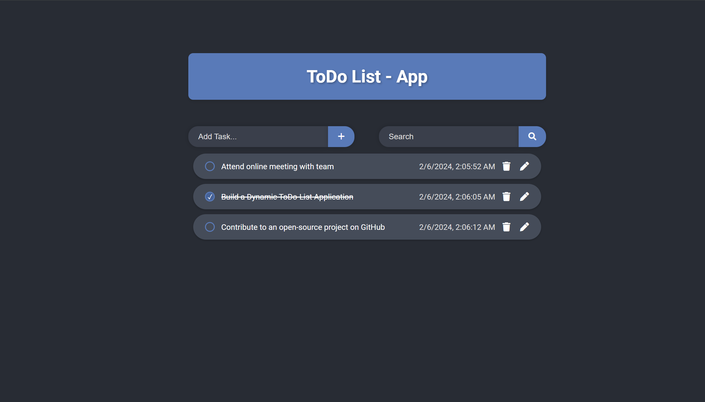

# ToDo List App

## About the Project

The ToDo List App is a simple web application built using ReactJS. It allows users to manage their tasks by adding, deleting, editing, and searching for tasks.

## Features

- Add tasks
- Delete tasks
- Edit tasks
- Search tasks
- Mark tasks as completed

## Technologies Used

- HTML
- CSS
- JavaScript
- ReactJS